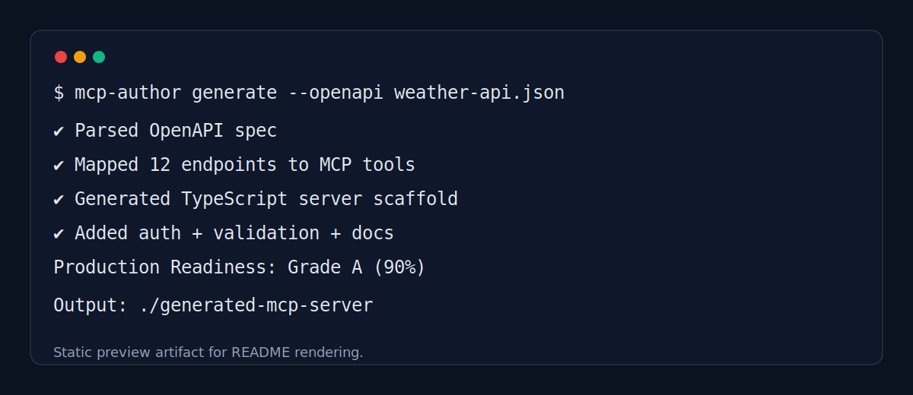

<div align="center">


# MCP Author

### From any API to a production-ready MCP server — in 60 seconds.

[](https://www.npmjs.com/package/mcp-author)
[](https://github.com/ai-craftsman404/mcp-author/actions)
[](https://opensource.org/licenses/MIT)
[](https://nodejs.org/)
[](https://www.typescriptlang.org/)
[](#production-readiness-scoring)

[**Quick Start**](#quick-start) · [**How It Works**](#how-it-works) · [**Examples**](#examples) · [**CLI Reference**](#cli-reference)

</div>

---

## The Problem

Building an MCP server from scratch means writing **300+ lines of boilerplate** — authentication wiring, tool registration, error handling, type definitions — before you write a single line of real logic.

If you already have an OpenAPI spec, you're describing the same API twice.

**MCP Author eliminates the boilerplate entirely.**

---

## Quick Start

```bash
# Install globally
npm install -g mcp-author

# Generate from an OpenAPI spec
mcp-author generate --openapi your-api.json

# Or use the interactive wizard
mcp-author generate
```

> **No OpenAPI spec?** The guided 7-question wizard configures your server interactively. Type `restart` or `abort` at any prompt.

---

## How It Works

<div align="center">

</div>

<br>

| Step | What happens |
|------|-------------|
| **1. Ingest** | Upload an OpenAPI spec (file or URL), or answer 7 guided questions |
| **2. Analyse** | Automatic endpoint-to-tool mapping, authentication detection, parameter extraction |
| **3. Generate** | Complete MCP server scaffold in TypeScript or Python, with docs and tests |
| **4. Validate** | Production readiness scored across 7 categories — graded A through F |

---

## Terminal Demo

<div align="center">

</div>

---

## Generated Output

Running `mcp-author generate --openapi weather-api.json` produces:

```
🔐 Detected authentication: api_key

🎉 Generation Complete!

📁 Output: ./generated-mcp-server
🛠️  Tools generated:
   • getCurrentWeather    (GET /weather)
   • getWeatherForecast   (GET /forecast)

📊 Production Readiness: Grade A (90%)

🚀 Next steps:
   cd ./generated-mcp-server && npm install && npm run build
```

**Project structure created:**

```
generated-mcp-server/
├── src/
│   ├── server.ts          # MCP server entry point
│   └── tools/             # One file per generated tool
├── tests/                 # Test scaffolding
├── package.json
├── tsconfig.json
├── .env.example
└── README.md              # Setup guide, generated for your API
```

---

## Before & After

<div align="center">

</div>

<br>

| | Without MCP Author | With MCP Author |
|--|-------------------|-----------------|
| **Setup time** | 2–4 hours | 60 seconds |
| **Boilerplate** | 300+ lines manual | Auto-generated |
| **Auth wiring** | Manual for each API | Auto-detected from spec |
| **Validation** | None by default | Grade A scoring built-in |
| **Docs** | Write yourself | Generated with server |

---

## Production Readiness Scoring

Every generated server is scored across **7 categories** before you write a line of custom logic:

<div align="center">

</div>

<br>

| Category | Points | What's checked |
|----------|--------|---------------|
| **Security** | 10 | No hardcoded secrets, env var usage, input validation |
| **Error Handling** | 10 | Try-catch coverage, retry logic, graceful degradation |
| **Documentation** | 10 | README completeness, setup instructions, examples |
| **Testing** | 10 | Test directory, unit test scaffolding |
| **Performance** | 10 | Caching, timeouts, pagination, response filtering |
| **Configuration** | 10 | package.json scripts, tsconfig, .env.example |
| **Code Quality** | 10 | TypeScript strict mode, ESLint, type coverage |

Grades: **A+** (95%+) · **A** (90%+) · **B** (80%+) · **C** (70%+) · **F** (<60%)

---

## CLI Reference

```bash
# Generate a server
mcp-author generate [options]
  --openapi <file|url>   OpenAPI spec (JSON or YAML)
  --language <lang>      typescript (default) | python
  --output <dir>         Output directory
  --auth <type>          api_key | oauth2 | basic | none

# Validate an existing server
mcp-author validate <server-path>

# Browse example configurations
mcp-author examples
```

---

## Examples

### Stripe Payments API
```bash
mcp-author generate --openapi examples/stripe-api.yaml --language typescript --auth api_key
```

### GitHub API (OAuth)
```bash
mcp-author generate --openapi examples/github-api.yaml --language python --auth oauth2
```

### No spec? Use the wizard
```bash
mcp-author generate
# 7 guided questions · type "restart" or "abort" at any point
```

---

## Requirements

| Requirement | Version |
|-------------|---------|
| Node.js | 18.0.0+ |
| npm | 9.0.0+ |
| Python *(Python generation only)* | 3.8+ |

---

## Contributing

```bash
git clone https://github.com/ai-craftsman404/mcp-author.git
cd mcp-author
npm install
npm run dev
```

1. Fork → feature branch → changes → `npm test` → pull request
2. All PRs require passing CI and 80%+ test coverage

---

## Architecture Motifs

<div align="center">

</div>

<br>

<div align="center">

</div>

---

<div align="center">


**Built for developers who ship.**

[MCP Documentation](https://modelcontextprotocol.io/) · [MCP Inspector](https://github.com/modelcontextprotocol/inspector) · [Issues](https://github.com/ai-craftsman404/mcp-author/issues) · [Discussions](https://github.com/ai-craftsman404/mcp-author/discussions)

*MIT License · Made with precision*

</div>
